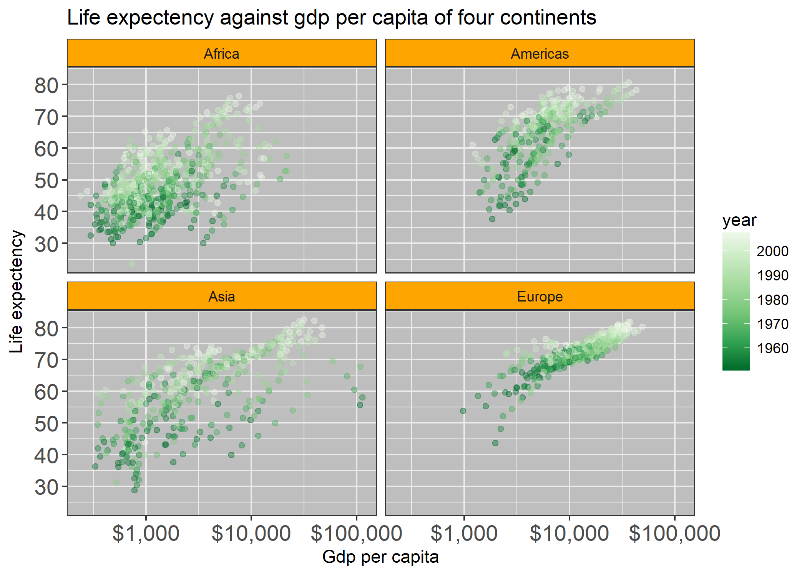
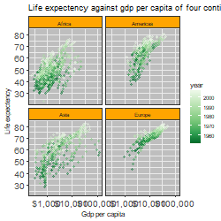
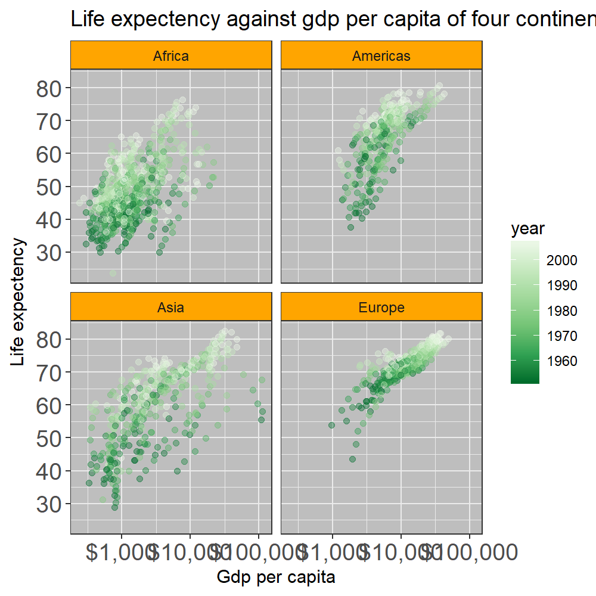

## Setting ups
```{r}
suppressPackageStartupMessages(library(tidyverse))
suppressPackageStartupMessages(library(gapminder))
suppressPackageStartupMessages(library(forcats))
suppressPackageStartupMessages(library(scales))
suppressPackageStartupMessages(library(plotly))
```

## Part 1: Factor management

First we need to ensure which of the columns are factors. From the output of `str` function we can see here `country` and `continent` are factors. The number of levels in `country` is 142, and 5 for the `continent`.

```{r}
gapminder %>% 
  str()

gapminder$continent %>%
  levels()
```

### Drop Oceania

Then we can apply some filter to the data frame followed by `droplevels` and see what happens. Here we see the unused levels of the factors are gone. 2 of the levels in `country` are gone, and the Oceania drops from `continent`. Via the filter, 24 rows of the data are also removed and the number of rows decreases from 1704 to 1680.
```{r}
gap_wo_oc <- gapminder %>%
  filter(continent != "Oceania") %>%
  droplevels()

gap_wo_oc %>%
  str()

gap_wo_oc$continent %>%
  levels()
```

### Reorder the levels of `country`

By using `fct_reorder` we can easily reorder the levels in the factors.

```{r}
big_pop <- gapminder %>% 
  filter(continent == "Americas") %>%
  group_by(country) %>%
  summarise(pop = pop[year == 2007]) %>%
  filter(pop > 1e7)

big_pop %>%
  mutate(country = fct_reorder(country, pop)) %>%
  ggplot(aes(pop, country)) +
  geom_point()
```

### Explore the effects of `arrange`

By applying `arrange`, we can see that the order in the data frame actually changed, but there are no affect on the plots.

```{r}
big_pop_ordered <- big_pop %>%
  arrange(pop)

knitr::kable(big_pop_ordered)

big_pop_ordered %>%
  ggplot(aes(pop, country)) +
  geom_point()
```

So with `fct_reorder` and `arrange` now thr data frame is reordered in both tables and the plots.

```{r}
big_pop_reordered <- big_pop %>%
  mutate(country = fct_reorder(country, pop)) %>%
  arrange(pop)

knitr::kable(big_pop_reordered)

big_pop_reordered %>%
  ggplot(aes(pop, country)) +
  geom_point()
```

## Part 2: File I/O

In this part we can use the previous `big_pop` data frame and do some file IO experiments. First we save the data frame using `write_csv`, `write_tsv`, `saveRDS` and `dput`.

```{r}
big_pop_saved <- tail(big_pop_reordered, 6) %>%
  droplevels()

knitr::kable(big_pop_saved)

write_csv(big_pop_saved, "big_pop.csv")
write_tsv(big_pop_saved, "big_pop.tsv")
saveRDS(big_pop_saved, "big_pop.rds")
dput(big_pop_saved, "big_pop.txt")
```

Then we read them back and see what happens.

```{r}
big_pop_csv <- read_csv("big_pop.csv")
knitr::kable(big_pop_csv)
big_pop_tsv <- read_tsv("big_pop.tsv")
knitr::kable(big_pop_tsv)
big_pop_rds <- readRDS("big_pop.rds")
knitr::kable(big_pop_rds)
big_pop_txt <- dget("big_pop.txt")
knitr::kable(big_pop_txt)
```

## Part 3: Visualization design

The graph below shows where we start. It is not too bad, but with a little more working we can make it different.

```{r}
gapminder %>% 
  ggplot(aes(gdpPercap, 
             lifeExp, 
             color = year)) + 
  geom_point() + 
  scale_x_log10()
```

Now here is what it looks like after some hard working. It is more readable, with more infos, and has a title now so people know what it is for.

```{r}
(p <- 
  gapminder %>% 
  filter(continent != "Oceania") %>%
  ggplot(aes(gdpPercap, lifeExp)) + 
  geom_point(aes(color = year), alpha = 0.4) + 
  scale_x_log10(labels = dollar_format()) +
  scale_colour_distiller(palette = "Greens") +
  facet_wrap(~continent) + 
  scale_y_continuous(breaks = 10*1:10) +
  theme_bw() +
  labs(x = "Gdp per capita",
       y = "Life expectency",
       title = "Life expectency against gdp per capita of four continents"
       ) +
  theme(axis.text = element_text(size = 14),
        strip.background = element_rect(fill = "orange"),
        panel.background = element_rect(fill = "gray")
        )
)
  
```

Then we can trun this into a `plotly` graph. It allows more interactions with the graph compared with `ggplot` graph, including zoom in, select regions you want to see, or check the value of every point in the plot. It is cool and more suitable for presentations!

```{r}
ggplotly(p)
```


## Part 4: Writing figures to file

By using `ggsave` we can save the plot to a local file.

```{r}
ggsave("plot.png", p)
```

Then we can load it back from files in a html way.



We can actually save them in different format and different quality.

```{r}
ggsave("plot_l.bmp", p, device = "bmp", height = 5, width = 5, dpi = 50)
ggsave("plot_h.bmp", p, device = "bmp", height = 5, width = 5, dpi = 200)
```

Then we can load them back and see the difference.






