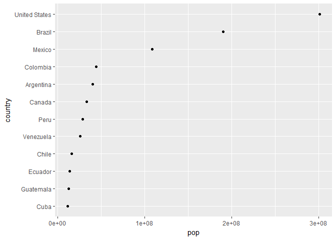
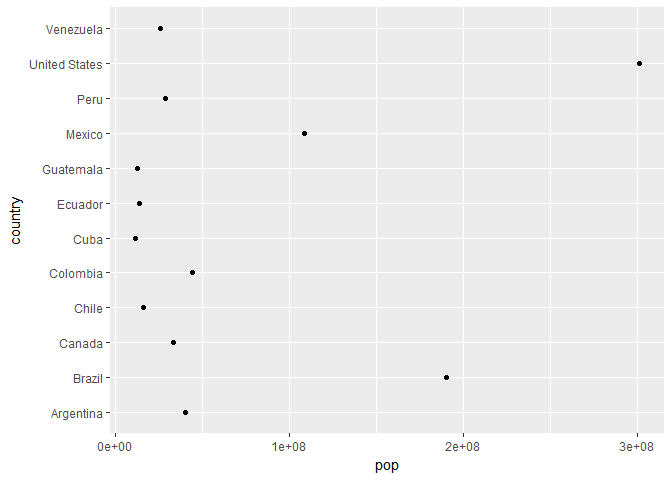
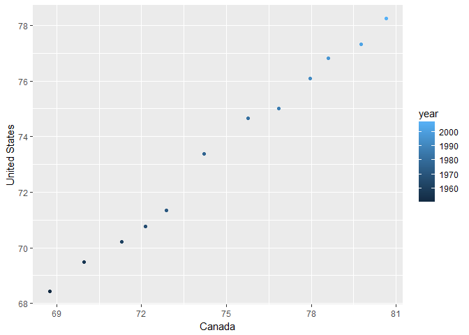

STAT545 hw05
================

## Setting ups

``` r
suppressPackageStartupMessages(library(tidyverse))
suppressPackageStartupMessages(library(gapminder))
suppressPackageStartupMessages(library(forcats))
```

## Part 1: Factor management

First we need to ensure which of the columns are factors. From the
output of `str` function we can see here `country` and `continent` are
factors. The number of levels in `country` is 142, and 5 for the
`continent`.

``` r
gapminder %>% 
  str()
```

    ## Classes 'tbl_df', 'tbl' and 'data.frame':    1704 obs. of  6 variables:
    ##  $ country  : Factor w/ 142 levels "Afghanistan",..: 1 1 1 1 1 1 1 1 1 1 ...
    ##  $ continent: Factor w/ 5 levels "Africa","Americas",..: 3 3 3 3 3 3 3 3 3 3 ...
    ##  $ year     : int  1952 1957 1962 1967 1972 1977 1982 1987 1992 1997 ...
    ##  $ lifeExp  : num  28.8 30.3 32 34 36.1 ...
    ##  $ pop      : int  8425333 9240934 10267083 11537966 13079460 14880372 12881816 13867957 16317921 22227415 ...
    ##  $ gdpPercap: num  779 821 853 836 740 ...

``` r
gapminder$continent %>%
  levels()
```

    ## [1] "Africa"   "Americas" "Asia"     "Europe"   "Oceania"

### Drop Oceania

Then we can apply some filter to the data frame followed by `droplevels`
and see what happens. Here we see the unused levels of the factors are
gone. 2 of the levels in `country` are gone, and the Oceania drops from
`continent`. Via the filter, 24 rows of the data are also removed and
the number of rows decreases from 1704 to 1680.

``` r
gap_wo_oc <- gapminder %>%
  filter(continent != "Oceania") %>%
  droplevels()

gap_wo_oc %>%
  str()
```

    ## Classes 'tbl_df', 'tbl' and 'data.frame':    1680 obs. of  6 variables:
    ##  $ country  : Factor w/ 140 levels "Afghanistan",..: 1 1 1 1 1 1 1 1 1 1 ...
    ##  $ continent: Factor w/ 4 levels "Africa","Americas",..: 3 3 3 3 3 3 3 3 3 3 ...
    ##  $ year     : int  1952 1957 1962 1967 1972 1977 1982 1987 1992 1997 ...
    ##  $ lifeExp  : num  28.8 30.3 32 34 36.1 ...
    ##  $ pop      : int  8425333 9240934 10267083 11537966 13079460 14880372 12881816 13867957 16317921 22227415 ...
    ##  $ gdpPercap: num  779 821 853 836 740 ...

``` r
gap_wo_oc$continent %>%
  levels()
```

    ## [1] "Africa"   "Americas" "Asia"     "Europe"

### Reorder the levels of `country`

By using `fct_reorder` we can easily reorder the levels in the factors.

``` r
big_pop <- gapminder %>% 
  filter(continent == "Americas") %>%
  group_by(country) %>%
  summarise(pop = pop[year == 2007]) %>%
  filter(pop > 1e7)

big_pop %>%
  mutate(country = fct_reorder(country, pop)) %>%
  ggplot(aes(pop, country)) +
  geom_point()
```

<!-- -->

### Explore the effects of `arrange`

By applying `arrange`, we can see that the order in the data frame
actually changed, but there are no affect on the plots.

``` r
big_pop_ordered <- big_pop %>%
  arrange(pop)

knitr::kable(big_pop_ordered)
```

| country       |       pop |
| :------------ | --------: |
| Cuba          |  11416987 |
| Guatemala     |  12572928 |
| Ecuador       |  13755680 |
| Chile         |  16284741 |
| Venezuela     |  26084662 |
| Peru          |  28674757 |
| Canada        |  33390141 |
| Argentina     |  40301927 |
| Colombia      |  44227550 |
| Mexico        | 108700891 |
| Brazil        | 190010647 |
| United States | 301139947 |

``` r
big_pop_ordered %>%
  ggplot(aes(pop, country)) +
  geom_point()
```

<!-- -->

So with `fct_reorder` and `arrange` now thr data frame is reordered in
both tables and the plots.

``` r
big_pop_reordered <- big_pop %>%
  mutate(country = fct_reorder(country, pop)) %>%
  arrange(pop)

knitr::kable(big_pop_reordered)
```

| country       |       pop |
| :------------ | --------: |
| Cuba          |  11416987 |
| Guatemala     |  12572928 |
| Ecuador       |  13755680 |
| Chile         |  16284741 |
| Venezuela     |  26084662 |
| Peru          |  28674757 |
| Canada        |  33390141 |
| Argentina     |  40301927 |
| Colombia      |  44227550 |
| Mexico        | 108700891 |
| Brazil        | 190010647 |
| United States | 301139947 |

``` r
big_pop_reordered %>%
  ggplot(aes(pop, country)) +
  geom_point()
```

<!-- -->

## Part 2: File I/O

In this part we can use the previous `big_pop` data frame and do some
file IO experiments. First we save the data frame using `write_csv`,
`write_tsv`, `saveRDS` and `dput`.

``` r
big_pop_saved <- tail(big_pop_reordered, 6) %>%
  droplevels()

knitr::kable(big_pop_saved)
```

| country       |       pop |
| :------------ | --------: |
| Canada        |  33390141 |
| Argentina     |  40301927 |
| Colombia      |  44227550 |
| Mexico        | 108700891 |
| Brazil        | 190010647 |
| United States | 301139947 |

``` r
write_csv(big_pop_saved, "big_pop.csv")
write_tsv(big_pop_saved, "big_pop.tsv")
saveRDS(big_pop_saved, "big_pop.rds")
dput(big_pop_saved, "big_pop.txt")
```

Then we read them back and see what happens.

``` r
big_pop_csv <- read_csv("big_pop.csv")
```

    ## Parsed with column specification:
    ## cols(
    ##   country = col_character(),
    ##   pop = col_integer()
    ## )

``` r
knitr::kable(big_pop_csv)
```

| country       |       pop |
| :------------ | --------: |
| Canada        |  33390141 |
| Argentina     |  40301927 |
| Colombia      |  44227550 |
| Mexico        | 108700891 |
| Brazil        | 190010647 |
| United States | 301139947 |

``` r
big_pop_tsv <- read_tsv("big_pop.tsv")
```

    ## Parsed with column specification:
    ## cols(
    ##   country = col_character(),
    ##   pop = col_integer()
    ## )

``` r
knitr::kable(big_pop_tsv)
```

| country       |       pop |
| :------------ | --------: |
| Canada        |  33390141 |
| Argentina     |  40301927 |
| Colombia      |  44227550 |
| Mexico        | 108700891 |
| Brazil        | 190010647 |
| United States | 301139947 |

``` r
big_pop_rds <- readRDS("big_pop.rds")
knitr::kable(big_pop_rds)
```

| country       |       pop |
| :------------ | --------: |
| Canada        |  33390141 |
| Argentina     |  40301927 |
| Colombia      |  44227550 |
| Mexico        | 108700891 |
| Brazil        | 190010647 |
| United States | 301139947 |

``` r
big_pop_txt <- dget("big_pop.txt")
knitr::kable(big_pop_txt)
```

| country       |       pop |
| :------------ | --------: |
| Canada        |  33390141 |
| Argentina     |  40301927 |
| Colombia      |  44227550 |
| Mexico        | 108700891 |
| Brazil        | 190010647 |
| United States | 301139947 |

## Part 3: Visualization design

## Part 4: Writing figures to file

``` r
lvsc <- gapminder %>%
  group_by(country) %>%
  filter(continent == "Americas" & pop[year == 2007] > 2e7) %>%
  select(year, country, lifeExp) %>%
  spread(key = "country", value = "lifeExp")
```

  - Use `knitr::kable()` to make this table look pretty in your rendered
    homework.

<!-- end list -->

``` r
knitr::kable(lvsc)
```

| year | Argentina | Brazil | Canada | Colombia | Mexico |   Peru | United States | Venezuela |
| ---: | --------: | -----: | -----: | -------: | -----: | -----: | ------------: | --------: |
| 1952 |    62.485 | 50.917 | 68.750 |   50.643 | 50.789 | 43.902 |        68.440 |    55.088 |
| 1957 |    64.399 | 53.285 | 69.960 |   55.118 | 55.190 | 46.263 |        69.490 |    57.907 |
| 1962 |    65.142 | 55.665 | 71.300 |   57.863 | 58.299 | 49.096 |        70.210 |    60.770 |
| 1967 |    65.634 | 57.632 | 72.130 |   59.963 | 60.110 | 51.445 |        70.760 |    63.479 |
| 1972 |    67.065 | 59.504 | 72.880 |   61.623 | 62.361 | 55.448 |        71.340 |    65.712 |
| 1977 |    68.481 | 61.489 | 74.210 |   63.837 | 65.032 | 58.447 |        73.380 |    67.456 |
| 1982 |    69.942 | 63.336 | 75.760 |   66.653 | 67.405 | 61.406 |        74.650 |    68.557 |
| 1987 |    70.774 | 65.205 | 76.860 |   67.768 | 69.498 | 64.134 |        75.020 |    70.190 |
| 1992 |    71.868 | 67.057 | 77.950 |   68.421 | 71.455 | 66.458 |        76.090 |    71.150 |
| 1997 |    73.275 | 69.388 | 78.610 |   70.313 | 73.670 | 68.386 |        76.810 |    72.146 |
| 2002 |    74.340 | 71.006 | 79.770 |   71.682 | 74.902 | 69.906 |        77.310 |    72.766 |
| 2007 |    75.320 | 72.390 | 80.653 |   72.889 | 76.195 | 71.421 |        78.242 |    73.747 |

  - Take advantage of this new data shape to scatterplot life expectancy
    for one country against that of another.

<!-- end list -->

``` r
lvsc %>%
  ggplot() +
  geom_point(aes(Canada, `United States`, color = year))
```

<!-- -->

## Join Prompts

### Activity \#1

##### Create a second data frame, complementary to Gapminder. Join this with (part of) Gapminder using a dplyr join function and make some observations about the process and result. Explore the different types of joins.

  - One row per country, a country variable and one or more variables
    with extra info, such as language spoken, NATO membership, national
    animal, or capitol city.

<!-- end list -->

``` r
ac <- gapminder %>%
  filter(continent == "Americas" & year == 2007) %>%
  select(-continent)
df1 <- tribble(
  ~country, ~`NATO membership`, ~`capital city`,
  "Canada", "Yes", "Ottawa",
  "United States", "Yes", "Washington",
  "Mexico", "No", "Mexico City",
  "Brazil", "No", "Brasilia",
  "Argentina", "No", "Buenos Aires"
)
```

Now we can explore `left_join`, `right_join`, `inner_join` and
`full_join`.

``` r
knitr::kable(left_join(ac, df1))
```

    ## Joining, by = "country"

    ## Warning: Column `country` joining factor and character vector, coercing
    ## into character vector

| country             | year | lifeExp |       pop | gdpPercap | NATO membership | capital city |
| :------------------ | ---: | ------: | --------: | --------: | :-------------- | :----------- |
| Argentina           | 2007 |  75.320 |  40301927 | 12779.380 | No              | Buenos Aires |
| Bolivia             | 2007 |  65.554 |   9119152 |  3822.137 | NA              | NA           |
| Brazil              | 2007 |  72.390 | 190010647 |  9065.801 | No              | Brasilia     |
| Canada              | 2007 |  80.653 |  33390141 | 36319.235 | Yes             | Ottawa       |
| Chile               | 2007 |  78.553 |  16284741 | 13171.639 | NA              | NA           |
| Colombia            | 2007 |  72.889 |  44227550 |  7006.580 | NA              | NA           |
| Costa Rica          | 2007 |  78.782 |   4133884 |  9645.061 | NA              | NA           |
| Cuba                | 2007 |  78.273 |  11416987 |  8948.103 | NA              | NA           |
| Dominican Republic  | 2007 |  72.235 |   9319622 |  6025.375 | NA              | NA           |
| Ecuador             | 2007 |  74.994 |  13755680 |  6873.262 | NA              | NA           |
| El Salvador         | 2007 |  71.878 |   6939688 |  5728.354 | NA              | NA           |
| Guatemala           | 2007 |  70.259 |  12572928 |  5186.050 | NA              | NA           |
| Haiti               | 2007 |  60.916 |   8502814 |  1201.637 | NA              | NA           |
| Honduras            | 2007 |  70.198 |   7483763 |  3548.331 | NA              | NA           |
| Jamaica             | 2007 |  72.567 |   2780132 |  7320.880 | NA              | NA           |
| Mexico              | 2007 |  76.195 | 108700891 | 11977.575 | No              | Mexico City  |
| Nicaragua           | 2007 |  72.899 |   5675356 |  2749.321 | NA              | NA           |
| Panama              | 2007 |  75.537 |   3242173 |  9809.186 | NA              | NA           |
| Paraguay            | 2007 |  71.752 |   6667147 |  4172.838 | NA              | NA           |
| Peru                | 2007 |  71.421 |  28674757 |  7408.906 | NA              | NA           |
| Puerto Rico         | 2007 |  78.746 |   3942491 | 19328.709 | NA              | NA           |
| Trinidad and Tobago | 2007 |  69.819 |   1056608 | 18008.509 | NA              | NA           |
| United States       | 2007 |  78.242 | 301139947 | 42951.653 | Yes             | Washington   |
| Uruguay             | 2007 |  76.384 |   3447496 | 10611.463 | NA              | NA           |
| Venezuela           | 2007 |  73.747 |  26084662 | 11415.806 | NA              | NA           |

``` r
knitr::kable(right_join(ac, df1))
```

    ## Joining, by = "country"

    ## Warning: Column `country` joining factor and character vector, coercing
    ## into character vector

| country       | year | lifeExp |       pop | gdpPercap | NATO membership | capital city |
| :------------ | ---: | ------: | --------: | --------: | :-------------- | :----------- |
| Canada        | 2007 |  80.653 |  33390141 | 36319.235 | Yes             | Ottawa       |
| United States | 2007 |  78.242 | 301139947 | 42951.653 | Yes             | Washington   |
| Mexico        | 2007 |  76.195 | 108700891 | 11977.575 | No              | Mexico City  |
| Brazil        | 2007 |  72.390 | 190010647 |  9065.801 | No              | Brasilia     |
| Argentina     | 2007 |  75.320 |  40301927 | 12779.380 | No              | Buenos Aires |

``` r
knitr::kable(inner_join(ac, df1))
```

    ## Joining, by = "country"

    ## Warning: Column `country` joining factor and character vector, coercing
    ## into character vector

| country       | year | lifeExp |       pop | gdpPercap | NATO membership | capital city |
| :------------ | ---: | ------: | --------: | --------: | :-------------- | :----------- |
| Argentina     | 2007 |  75.320 |  40301927 | 12779.380 | No              | Buenos Aires |
| Brazil        | 2007 |  72.390 | 190010647 |  9065.801 | No              | Brasilia     |
| Canada        | 2007 |  80.653 |  33390141 | 36319.235 | Yes             | Ottawa       |
| Mexico        | 2007 |  76.195 | 108700891 | 11977.575 | No              | Mexico City  |
| United States | 2007 |  78.242 | 301139947 | 42951.653 | Yes             | Washington   |

``` r
knitr::kable(full_join(ac, df1))
```

    ## Joining, by = "country"

    ## Warning: Column `country` joining factor and character vector, coercing
    ## into character vector

| country             | year | lifeExp |       pop | gdpPercap | NATO membership | capital city |
| :------------------ | ---: | ------: | --------: | --------: | :-------------- | :----------- |
| Argentina           | 2007 |  75.320 |  40301927 | 12779.380 | No              | Buenos Aires |
| Bolivia             | 2007 |  65.554 |   9119152 |  3822.137 | NA              | NA           |
| Brazil              | 2007 |  72.390 | 190010647 |  9065.801 | No              | Brasilia     |
| Canada              | 2007 |  80.653 |  33390141 | 36319.235 | Yes             | Ottawa       |
| Chile               | 2007 |  78.553 |  16284741 | 13171.639 | NA              | NA           |
| Colombia            | 2007 |  72.889 |  44227550 |  7006.580 | NA              | NA           |
| Costa Rica          | 2007 |  78.782 |   4133884 |  9645.061 | NA              | NA           |
| Cuba                | 2007 |  78.273 |  11416987 |  8948.103 | NA              | NA           |
| Dominican Republic  | 2007 |  72.235 |   9319622 |  6025.375 | NA              | NA           |
| Ecuador             | 2007 |  74.994 |  13755680 |  6873.262 | NA              | NA           |
| El Salvador         | 2007 |  71.878 |   6939688 |  5728.354 | NA              | NA           |
| Guatemala           | 2007 |  70.259 |  12572928 |  5186.050 | NA              | NA           |
| Haiti               | 2007 |  60.916 |   8502814 |  1201.637 | NA              | NA           |
| Honduras            | 2007 |  70.198 |   7483763 |  3548.331 | NA              | NA           |
| Jamaica             | 2007 |  72.567 |   2780132 |  7320.880 | NA              | NA           |
| Mexico              | 2007 |  76.195 | 108700891 | 11977.575 | No              | Mexico City  |
| Nicaragua           | 2007 |  72.899 |   5675356 |  2749.321 | NA              | NA           |
| Panama              | 2007 |  75.537 |   3242173 |  9809.186 | NA              | NA           |
| Paraguay            | 2007 |  71.752 |   6667147 |  4172.838 | NA              | NA           |
| Peru                | 2007 |  71.421 |  28674757 |  7408.906 | NA              | NA           |
| Puerto Rico         | 2007 |  78.746 |   3942491 | 19328.709 | NA              | NA           |
| Trinidad and Tobago | 2007 |  69.819 |   1056608 | 18008.509 | NA              | NA           |
| United States       | 2007 |  78.242 | 301139947 | 42951.653 | Yes             | Washington   |
| Uruguay             | 2007 |  76.384 |   3447496 | 10611.463 | NA              | NA           |
| Venezuela           | 2007 |  73.747 |  26084662 | 11415.806 | NA              | NA           |

  - One row per continent, a continent variable and one or more
    variables with extra info, such as northern versus southern
    hemisphere.

<!-- end list -->

``` r
conts <- gapminder %>%
  group_by(continent) %>%
  summarise(`country num` = length(country))
df2 <- tribble(
  ~continent, ~hemisphere,
  "Asia", "North",
  "Europe", "North",
  "Oceania", "South"
)
```

Again we can explore `left_join`, `right_join`, `inner_join` and
`full_join`
    now.

``` r
knitr::kable(left_join(conts, df2))
```

    ## Joining, by = "continent"

    ## Warning: Column `continent` joining factor and character vector, coercing
    ## into character vector

| continent | country num | hemisphere |
| :-------- | ----------: | :--------- |
| Africa    |         624 | NA         |
| Americas  |         300 | NA         |
| Asia      |         396 | North      |
| Europe    |         360 | North      |
| Oceania   |          24 | South      |

``` r
knitr::kable(right_join(conts, df2))
```

    ## Joining, by = "continent"

    ## Warning: Column `continent` joining factor and character vector, coercing
    ## into character vector

| continent | country num | hemisphere |
| :-------- | ----------: | :--------- |
| Asia      |         396 | North      |
| Europe    |         360 | North      |
| Oceania   |          24 | South      |

``` r
knitr::kable(inner_join(conts, df2))
```

    ## Joining, by = "continent"

    ## Warning: Column `continent` joining factor and character vector, coercing
    ## into character vector

| continent | country num | hemisphere |
| :-------- | ----------: | :--------- |
| Asia      |         396 | North      |
| Europe    |         360 | North      |
| Oceania   |          24 | South      |

``` r
knitr::kable(full_join(conts, df2))
```

    ## Joining, by = "continent"

    ## Warning: Column `continent` joining factor and character vector, coercing
    ## into character vector

| continent | country num | hemisphere |
| :-------- | ----------: | :--------- |
| Africa    |         624 | NA         |
| Americas  |         300 | NA         |
| Asia      |         396 | North      |
| Europe    |         360 | North      |
| Oceania   |          24 | South      |

### Activity \#3

##### Explore `merge` and `match`

``` r
knitr::kable(merge(df1, df2))
```

| country       | NATO membership | capital city | continent | hemisphere |
| :------------ | :-------------- | :----------- | :-------- | :--------- |
| Canada        | Yes             | Ottawa       | Asia      | North      |
| United States | Yes             | Washington   | Asia      | North      |
| Mexico        | No              | Mexico City  | Asia      | North      |
| Brazil        | No              | Brasilia     | Asia      | North      |
| Argentina     | No              | Buenos Aires | Asia      | North      |
| Canada        | Yes             | Ottawa       | Europe    | North      |
| United States | Yes             | Washington   | Europe    | North      |
| Mexico        | No              | Mexico City  | Europe    | North      |
| Brazil        | No              | Brasilia     | Europe    | North      |
| Argentina     | No              | Buenos Aires | Europe    | North      |
| Canada        | Yes             | Ottawa       | Oceania   | South      |
| United States | Yes             | Washington   | Oceania   | South      |
| Mexico        | No              | Mexico City  | Oceania   | South      |
| Brazil        | No              | Brasilia     | Oceania   | South      |
| Argentina     | No              | Buenos Aires | Oceania   | South      |

``` r
match(df1, df2)
```

    ## [1] NA NA NA

``` r
match(ac$country, gapminder$country)
```

    ##  [1]   49  133  169  241  277  301  349  385  433  445  469  601  637  649
    ## [15]  781  985 1105 1177 1189 1201 1249 1549 1609 1621 1633
